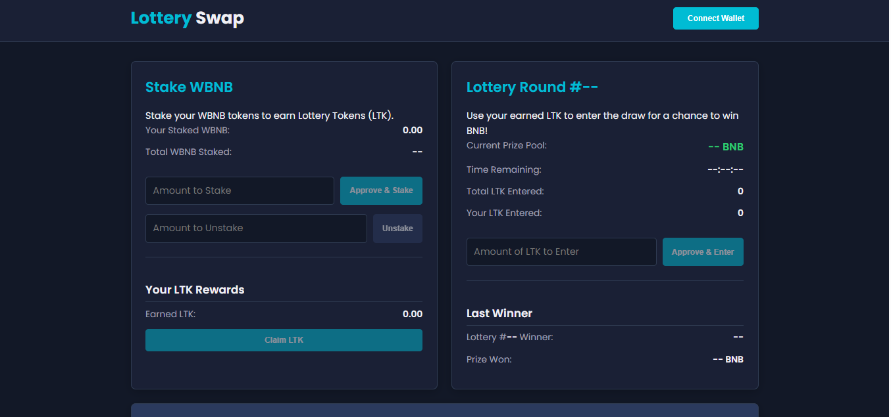

# testcontracts

# ✨ Lottery Swap ✨

**Stake WBNB, Earn LTK, Win WBNB!**

Welcome to Lottery Swap, an open-source DeFi experiment combining yield generation through staking with the excitement of a lottery!

## Introduction

Lottery Swap aims to create a fun and potentially rewarding way for users to interact with DeFi on the BNB Smart Chain. By staking WBNB, users earn a dedicated Lottery Token (LTK), which they can then use to enter regular lottery draws for a chance to win WBNB prizes.

## Core Concept

The user journey is designed to be simple:

1.  **Stake:** Users stake their WBNB tokens in the `StakingContract`.
2.  **Earn:** While staked, users automatically earn `LotteryToken` (LTK) proportionally to their staked amount.
3.  **Enter:** Users claim their earned LTK and enter it into the active lottery round via the `LotteryContract`. More LTK entered potentially means a higher chance of winning.
4.  **Win:** Every two weeks (initial plan), the `LotteryContract` uses Chainlink VRF v2 to securely and verifiably select a winner from the entries, who receives the WBNB prize pool for that round.

## Current Status & Vision

🚀 **This is the very beginning!** 🚀

The contracts provided in this repository (`LotteryToken.sol`, `StakingContract.sol`, `LotteryContract.sol`) represent an **initial prototype** and a **glimpse** into the core mechanics. They are intended to spark discussion, demonstrate the concept, and serve as a foundation for collaboration.

This project is **fully open-source**, and the vision is to build this out collaboratively. We believe in the power of the community to refine, secure, and expand upon this initial idea.

**These contracts are NOT production-ready and require significant further development, testing, and auditing.**

## Technology Stack

*   **Smart Contracts:** Solidity
*   **Standards:** OpenZeppelin Contracts
*   **Randomness:** Chainlink VRF v2
*   **Blockchain:** BNB Smart Chain (BSC)
*   **Tokens:** WBNB (Stake & Prize), LTK (Reward/Entry Token - ERC20)
*   **Frontend Example:** HTML, CSS, JavaScript (using Ethers.js)

## We Need Your Help! Call for Collaboration 🤝

This is where **YOU** come in! We are actively looking for collaborators to help build Lottery Swap into a robust and exciting dApp. We welcome contributions in many forms:

*   **💡 New Ideas & Feedback:** Suggest improvements, new features, tokenomic adjustments, different lottery mechanics, UI/UX enhancements, or anything else! Please open an Issue to discuss.
*   ** Llc<0xF0><0x9F><0xA7><0xBE> Smart Contract Developers:** Help refine the existing contracts, improve gas efficiency, enhance security, and develop new features (e.g., automated draw triggers, advanced staking options, DAO governance).
*   **🖥️ Full Stack Developers:** Improve the example frontend, build a more robust interface (React/Vue/Svelte preferred), integrate backend services if needed, enhance user experience.
*   **🔒 Security Auditors:** **CRITICAL!** We are actively seeking security researchers and professional auditing firms to review the smart contracts once they reach a more mature state. Security is paramount.
*   **🧪 Testers:** Help rigorously test the contracts and frontend on testnets, identify bugs, and report issues.

## How to Contribute

1.  **Discuss:** Open an Issue to discuss ideas, bugs, or features.
2.  **Fork:** Fork this repository.
3.  **Develop:** Create a new branch for your feature or fix (`git checkout -b feature/your-feature-name`).
4.  **Code:** Make your changes.
5.  **Test:** Ensure your changes work and don't break existing functionality (formal tests are needed!).
6.  **Submit:** Push your branch and open a Pull Request back to the main repository.

## ⚠️ Disclaimer ⚠️

Decentralized Finance (DeFi) involves significant risks, including the potential loss of funds. The smart contracts in this repository are experimental, **unaudited**, and provided "as is" without warranty of any kind.

**Do NOT deposit any significant value into these prototype contracts.** Interacting with them is entirely at your own risk. This project does not constitute financial advice.

## Contact

To discuss collaboration, partnerships, auditing, or joining the development team, please reach out to:

📧 **esthergh141@gmail.com**

Let's build something cool together!

## License

This project is licensed under the MIT License. See the LICENSE file for details. (You'll need to add a LICENSE file with the MIT license text).
